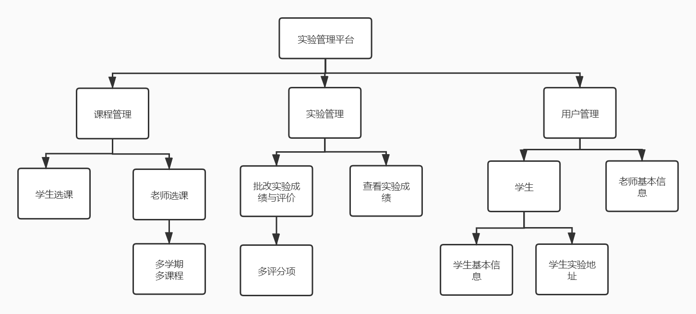
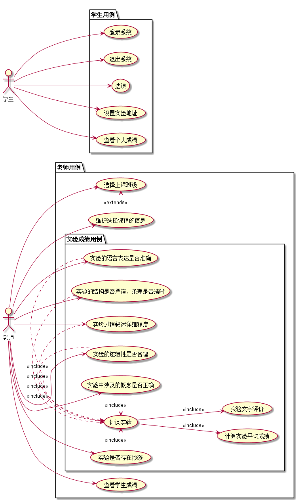
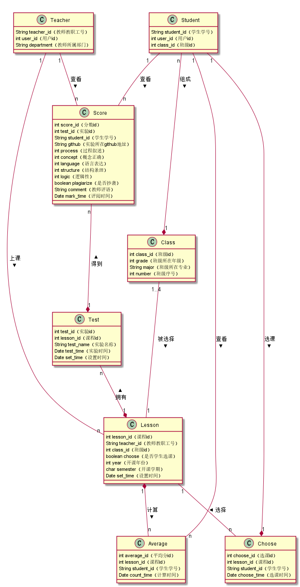

# 实验6：基于GitHub的实验管理平台的分析与设计
|学号|班级|姓名|
|:-------:|:-------------: | :----------:|
|201710414215|软件(本)17-2|施实伟|

***
## 1.概述
- 基于GitHub的实验管理平台的作用是在线管理实验成绩的Web应用系统。学生和老师的实验内容均存放在GitHUB 页面上。
- 学生主要功能：
    1. 登录系统。
    2. 登出系统。
    3. 管理GitHub个人基本信息，学生的GitHub用户名是公开的。
    4. 选择课程。
    5. 查看个人成绩，学生的GitHub个人成绩是不公开的。

- 老师主要功能：
    1. 登录系统。
    2. 登出系统。
    3. 管理GitHub个人基本信息。
    4. 维护选择课程的信息。
    5. 维护每个实验的信息。
    6. 批改学生实验成绩并输入对应的文字评价。
    7. 查看学生成绩。

- 选课时，老师和同学都可以选多门课程，但必须是老师先选，学生后选。
- 老师和学生都能通过本系统的链接方便地跳转到学生的每个GitHUB实验目录，以便批改实验或者查看实验情况。
- 学生实验成绩的评分项：
    1. （占比20%）实验过程叙述详细程度。
    2. （占比20%）实验中涉及的概念是否正确。
    3. （占比20%）实验的语言表达是否准确。
    4. （占比20%）实验的结构是否严谨、条理是否清晰。
    5. （占比20%）实验的逻辑性是否合理。
    6. 实验是否存在抄袭。
- 实验成绩按数字分数计算，每项实验的满分为100分，最低为0分。
- 系统自动计算每个学生"不同学期"，"不同课程"的所有实验的平均分。

***

## 2. 系统总体结构

界面设计参见： https://ssw383318348.github.io/is_analysis_pages/test6/index.html
***

## 3. 用例图设计

用例图源码:[UseCase.puml](src/UseCase.puml)

***

## 4. 类图设计

用例图源码:[class.puml](src/class.puml)

***

## 5. 数据库设计

- ### [参见数据库设计文档](./数据库设计.md)

***

## 6. 用例及界面详细设计

- ### [“修改密码”用例](./用例/修改密码.md),[界面](https://ssw383318348.github.io/is_analysis_pages/test6/修改密码.html)
- ### [“修改用户信息”用例](./用例/修改用户信息.md),[界面](https://ssw383318348.github.io/is_analysis_pages/test6/修改用户信息.html)
- ### [“查看成绩_学生”用例](./用例/查看成绩_学生.md),[界面](https://ssw383318348.github.io/is_analysis_pages/test6/查看成绩_学生.html)
- ### [“查看成绩_老师”用例](./用例/查看成绩_老师.md),[界面](https://ssw383318348.github.io/is_analysis_pages/test6/查看成绩_老师.html)
- ### [“查看用户信息”用例](./用例/查看用户信息.md),[界面](https://ssw383318348.github.io/is_analysis_pages/test6/查看用户信息.html)
- ### [“登出”用例](./用例/登出.md),[界面](https://ssw383318348.github.io/is_analysis_pages/test6/登出.html)
- ### [“登录_学生”用例](./用例/登录.md),[界面](https://ssw383318348.github.io/is_analysis_pages/test6/登录_学生.html)
- ### [“登录_老师”用例](./用例/登录.md),[界面](https://ssw383318348.github.io/is_analysis_pages/test6/登录_老师.html)
- ### [“评定成绩”用例](./用例/评定成绩.md),[界面](https://ssw383318348.github.io/is_analysis_pages/test6/评定成绩.html)
- ### [“选课_学生”用例](./用例/选课_学生.md),[界面](https://ssw383318348.github.io/is_analysis_pages/test6/选课_学生.html)
- ### [“选课_老师”用例](./用例/选课_老师.md),[界面](https://ssw383318348.github.io/is_analysis_pages/test6/选课_老师.html)
   
***