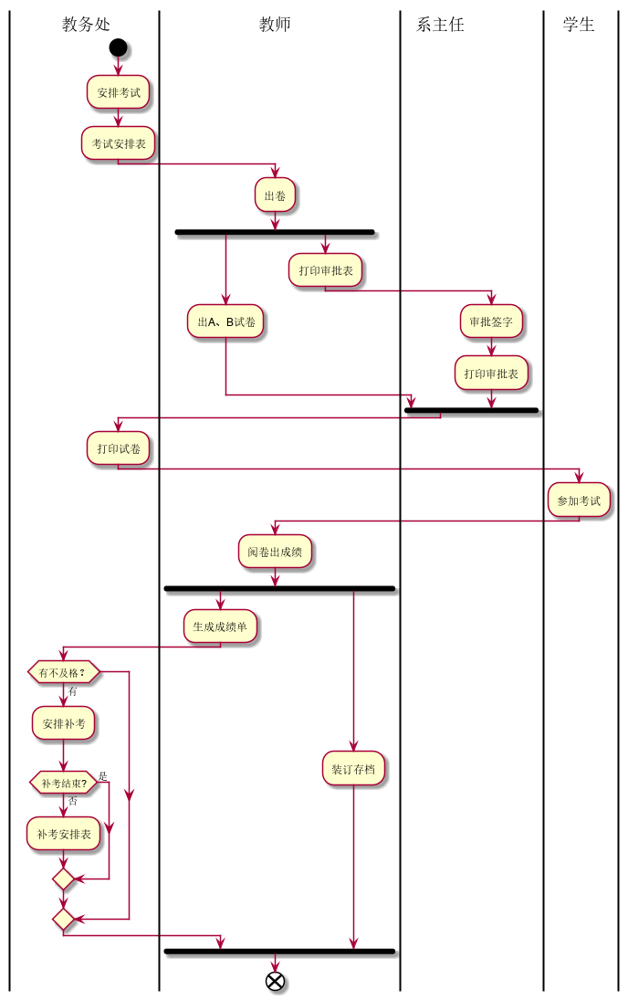
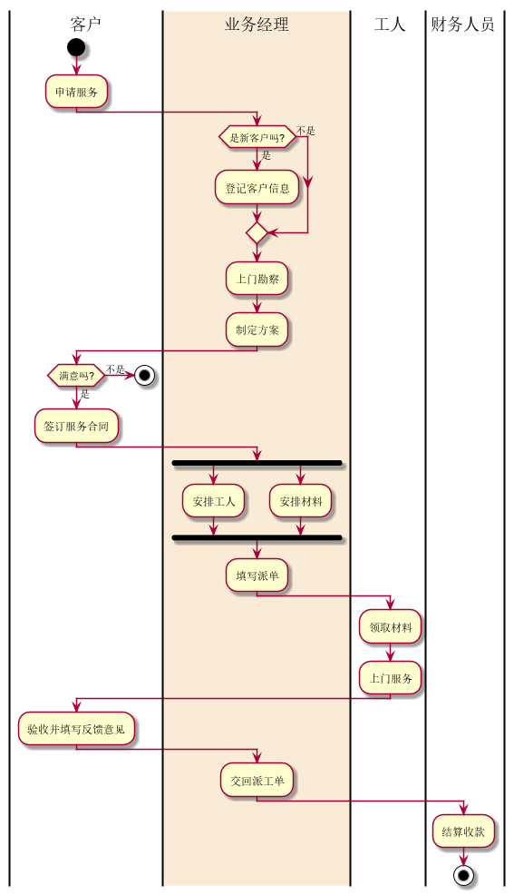

# 实验1：业务流程建模

| 学号         | 班级         | 姓名 | 照片                                                         |
| :----------- | :----------- | :--- | :----------------------------------------------------------- |
| 201710414205 | 软件(本)17-2 | 胡古 |  |

## 流程图1：考试及成绩管理流程

### PlantUML源码如下：

```UML
@startuml
|教务处|
start
:安排考试;
:考试安排表;
|教师|
:出卷;
fork
:出A、B试卷;
fork again
:打印审批表;
|系主任|
:审批签字;
:打印审批表;
end fork
|教务处|
:打印试卷;
|学生|
:参加考试;
|教师|
:阅卷出成绩;
fork
:生成成绩单;
|教务处|
if (有不及格？) then (有)
:安排补考;
if(补考结束?)then (是)
else (否)
:补考安排表;
endif
endif
fork again
|教师|
:装订存档;
end fork
end
@enduml
```

### 业务流程图如下：



### 流程说明

首先有教务处安排考试，并作出考试安排表，交由教师出卷，教师打印审批表和出A、B试卷，交给系主任审批签字并打印审批表，再打印试卷，把试卷交给学生参加考试，再由教师阅卷出成绩，生成成绩单，再有教务处判断是否有不几个，有则补考，并补考结束，并装订存档。

## 流程图2：客户维修服务流程

### PlantUML源码如下：

```UML
@startuml
|客户|
start
:申请服务;
|#AntiqueWhite|业务经理|
     if (是新客户吗?) then (是)
           :登记客户信息;
     else(不是)
     endif
:上门勘察;
:制定方案;
|客户|
 if (满意吗?) then (是)
           :签订服务合同;
     else(不是)
     stop
     endif
|业务经理|
fork
	:安排工人;
fork again
	:安排材料;
	end fork
:填写派单;
|工人|
:领取材料;
:上门服务;
|客户|
:验收并填写反馈意见;
|业务经理|
:交回派工单;
|财务人员|
:结算收款;
stop
@enduml
```

业务流程如下：



### 流程说明：

首先是客户申请服务，然后让业务经理判断是否是新客户，是则等级客户信息并上门勘察，不是则直接上门勘察并指定方案，再由客户判断是否满意，不满意则结束，满意则签订服务合同；再由业务经理安排工人、安排材料，完成之后填写派单交给工人领取材料并上门服务，由客户验收并填写反馈意见并交给业务经理交回派工单；最后把派工单交给财务人员并结算收款，最后结束。
