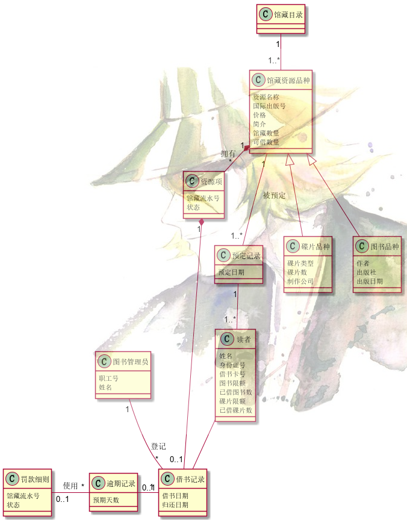
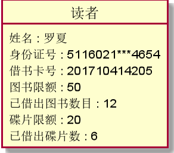

# 实验3：图书管理系统领域对象建模

|     学号     |     班级     | 姓名 |
| :----------: | :----------: | :--: |
| 201710414205 | 软件(本)17-2 | 胡古 |

## 1. 图书管理系统的类图

### 1.1 类图PlantUML源码如下：

``` class
@startuml
class 馆藏目录 {
}
class 馆藏资源品种 {
   资源名称
   国际出版号
   价格
   简介
   馆藏数量
   可借数量
}
class 资源项 {
   馆藏流水号
   状态
}
class 预定记录 {
   预定日期
}
class 碟片品种 {
   碟片类型
   碟片数
   制作公司
}
class 图书品种 {
   作者
   出版社
   出版日期
}
class 借书记录 {
   借书日期
   归还日期
}
class 读者 {
   姓名
   身份证号
   借书卡号
   图书限额
   已借图书数
   碟片限额
   已借碟片数
}
class 图书管理员 {
   职工号
   姓名
}
class 逾期记录 {
   预期天数
}
class 罚款细则 {
   馆藏流水号
   状态
}

馆藏目录 "1" -- "1..*" 馆藏资源品种
馆藏资源品种 "1" -- "1..*" 预定记录 :被预定
预定记录 "1" -- "1..*" 读者
馆藏资源品种 "1" *- "*" 资源项 :拥有
馆藏资源品种 <|-- 碟片品种
馆藏资源品种 <|-- 图书品种
资源项 "1" *-- "0..1" 借书记录
图书管理员 "1"--"*" 借书记录 :登记
逾期记录 "0..1"-"1" 借书记录
读者 -- 借书记录
罚款细则 "0..1"-"*" 逾期记录 :使用


@enduml
```

### 1.2. 类图如下：




### 1.3. 类图说明：

1.识别出全部的概念类分别为：
馆藏目录、馆藏资源品种、预定记录、资源项、碟片品种、图书品种、借书记录、读者、图书管理员2、逾期记录、罚款细则

 2.添加概念类的属性：例如：馆藏资源品种 : 资源名称
馆藏资源品种 : 国际出版号
馆藏资源品种 : 价格
馆藏资源品种 : 简介
馆藏资源品种 : 馆藏数量
馆藏资源品种 : 可借数量

3.将所有的概念类关联起来：（关系的声明）

| 关系                        | 符号                               | 说明                                       |
| :-------------------------- | :--------------------------------- | :----------------------------------------- |
| 接口与实现关系              | <1..或者..1>                       | 带空心三角型的虚线表示                     |
| 依赖(Dependency)关系        | <..或者..>                         | 带箭头的虚线表示                           |
| 单向关联(Association)       | <-- 或者 -->                       | 带箭头的实线表示                           |
| 双向关联                    | --                                 | 直线表示                                   |
| 多重性关联                  | “1..*”<--"0..*"或者 “0..*”--“1..*” | 关联直线上用一个数字或者一个数字的范围表示 |
| 聚合(Aggregation)关系       | o--或者--o                         | 英语O 1带空心菱形的直线表示                |
| 组合(Composition)关系       | *--或者--*                         | 带实心的菱形的直线表示                     |
| 泛化关系(继承[Inheritance]) | <1-- 或者 --1>                     | 带空心三角型的直线表示                     |

4.泛化处理形成领域模型

## 2. 图书管理系统的对象图

### 2.1 类user的对象图

#### 源码如下：

``` class
@startuml
object 读者 {
姓名 : 罗夏
身份证号 : 5116021***4654
借书卡号 : 201710414205
图书限额 : 50
已借出图书数目 : 12
碟片限额 : 20
已借出碟片数 : 6
}


@enduml
```

#### 对象图如下：



### 2.2 类图书品种的对象图

#### 源码如下：

``` class
@startuml
object 图书品种 {
作者：刘明
出版社：光明出版社
出版日期：2018-08-20
}
@enduml
```

#### 对象图如下：


## 3.总结
在这次实验中，需要分析知道有多少个类，完成类的创建，例如创建读者该类，创建后需要给该类添加属性。完成类创建后需要对类与类之间进行关系联系。如图书管理员该类需要登记借书记录类。

完成类的创建后，还需要对象，所以使用object关键字画出该类的对象

在这次实验中，更加熟悉了planUML工具的使用，提升了对对象与类的分析
