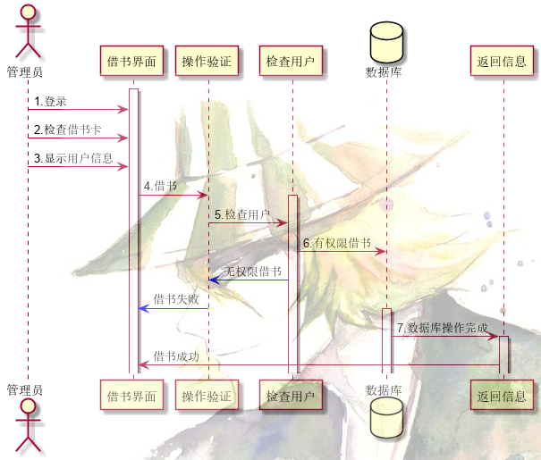

# 实验4：图书管理系统顺序图绘制

|     学号     |     班级     | 姓名 |
| :----------: | :----------: | :--: |
| 201710414205 | 软件(本)17-2 | 胡古 |

## 图书管理系统的顺序图

## 1. 借书用例

## 1.1. 借书用例PlantUML源码


``` 
@startuml
actor 管理员
participant "借书界面" as A
participant "操作验证" as B
participant "检查用户" as C
database 数据库 as D
participant "返回信息" as E
activate A
管理员 -> A :1.登录
管理员 -> A :2.检查借书卡
管理员 -> A :3.显示用户信息
A -> B :4.借书
activate C
B -> C :5.检查用户
C -> D :6.有权限借书
C -[#0000FF]> B :无权限借书
B -[#0000FF]> A :借书失败
activate D
D -> E :7.数据库操作完成
activate E
E -> A :借书成功
@enduml
```

## 1.2. 借书用例顺序图



## 1.3. 借书用例顺序图说明

首先由管理员登录，然后检查借书卡，显示用户信息进入借书界面，对操作进行验证，验证为借书操作。

检查用户，查看用户是否能够借书，如果用户因其他原因不能借书，例如图书未归还，返回给操作验证无权借书，并显示在借书界面借书失败。

检查用户为有权借书，则与数据库进行交互，数据库完成增删改查后返回给下一步，下一步返回信息，在借书界面显示借书成功

***

## 2. 还书用例

## 2.1. 还书用例PlantUML源码

``` 
@startuml
actor 读者
actor 管理员
participant "还书界面" as A
participant "操作验证" as B
participant "还书扫描" as C
participant "确认操作" as D
database 数据库 as E
participant "返回信息" as F
读者 -> 管理员 :1.图书交付
activate A
管理员 -> A :2.登录
A -> B:3.还书操作
activate C
B -> C :4.扫描数据条形码
C -> D :5.确认还书
activate D
D -> E :6.还书正确
activate E
E -> F :7.数据库更新
F -> A :8.返回还书成功
@enduml
```

## 2.2. 还书用例顺序图


## 2.3. 还书用例顺序图说明

首先需要读者将图书交付给图书管理员，交付后由管理员进行登录操作，登录成功后需要验证操作是否为还书操作。

操作验证为还书操作后，扫描书籍条形码，并确认还书，还书还需要由数据库进行更新操作，更新用户已经还书，之后返回信息给还书界面显示还书成功

***

## 3.1总结

在这次实验中， 掌握顺序图的作用，对象交互模式，消息在对象交互中的作用，以及顺序图与活动图（通常叫流程图）的区别。 

通过这次实验，更加熟悉了planUML工具的使用，提升了对操作的时序图的分析能力，对我以后进行完成项目中分析问题的能力有了很大的提高。
