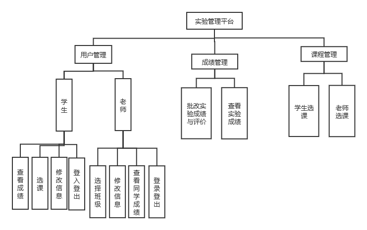
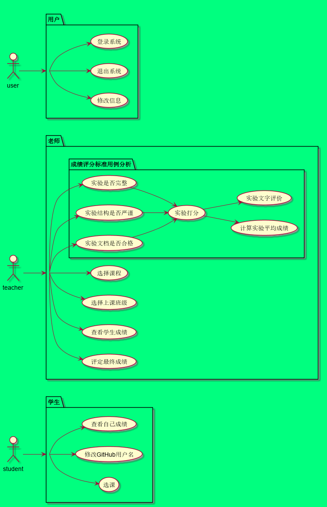
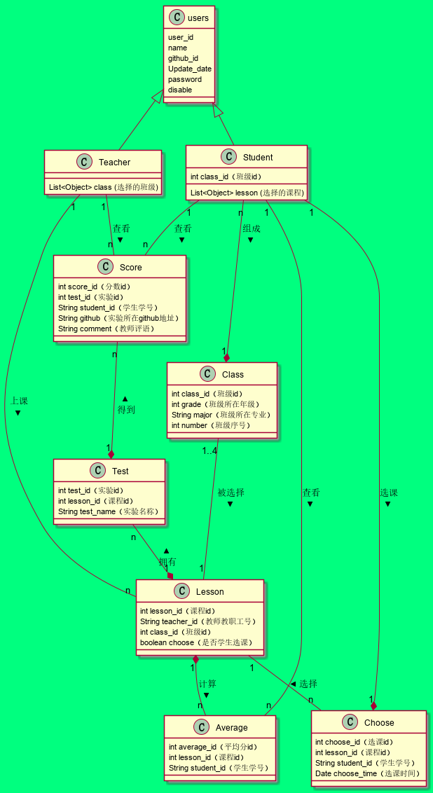

# 基于GitHub的实验管理平台的分析与设计

### 成都大学信息科学与工程学院

|     学号     |     班级     | 姓名 |
| :----------: | :----------: | :--: |
| 201710414205 | 软件(本)17-2 | 胡古 |

## 1. 概述

- 学生Class继承用户Class，用户有的方法学生一定有，学生有的方法用户不一定有
- 老师Class继承用户Class，用户有的方法老师一定有，老师有的方法用户不一定有
- 学生可以选择多个课程，即多个老师
- 老师可以选择多个班级，即多个学生
- 老师与学生关系是多对多的关系，即需要建立一张中间表

### 1.1.用户

1. 用户登入系统
2. 用户等处系统
3. 修改个人信息

### 1.2.学生

1. 学生选课
2. 学生查看成绩

### 1.3.老师

1. 老师选择班级
2. 老师登入成绩以及评论
3. 老师查看学生成绩以及评论

## 2. 系统总体结构

界面设计参见：https://zwdcdu.github.io/is_analysis/test6/ui/index.html
    
## 3. 用例图设计 [源码](src/UseCase.puml)

## 4. 类图设计 [源码](src/class.puml)

## 5. 数据库设计
- ### [参见数据库设计](./数据库设计.md)

## 6. 用例及界面详细设计
- ### [“修改密码”用例](src//用例/修改密码.md),[界面](https://201710414205.github.io/is_analysis_pages/test6/ui/修改用户信息.html)

- ### [“修改用户信息”用例](src//用例/修改用户信息.md),[界面](https://201710414205.github.io/is_analysis_pages/test6/ui/修改用户信息.html)

- ### [“查看成绩_学生”用例](src//用例/查看成绩_学生.md),[界面](https://201710414205.github.io/is_analysis_pages/test6/ui/成绩与评语.html)

- ### [“查看成绩_老师”用例](src//用例/查看成绩_老师.md),[界面](https://201710414205.github.io/is_analysis_pages/test6/ui/老师评分.html)

- ### [“查看用户信息”用例](src/用例/查看用户信息.md),[界面](https://201710414205.github.io/is_analysis_pages/test6/ui/用户信息.html)

- ### [“登出”用例](src/用例/登出.md),[界面](https://201710414205.github.io/is_analysis_pages/test6/ui/学生主页.html)

- **[“登入”用例](src/用例/登录_学生.md),[界面](https://201710414205.github.io/is_analysis_pages/test6/io/登入.html)**

- ### [“评定成绩”用例](src//用例/评定成绩.md),[界面](https://201710414205.github.io/is_analysis_pages/test6/ui/老师评分.html)

- ### [“选课_学生”用例](src//用例/选课_学生.md),[界面](https://ssw383318348.github.io/is_analysis_pages/test6/ui/学生选课.html)

- ### [“选课_老师”用例](src//用例/选课_老师.md),[界面](https://ssw383318348.github.io/is_analysis_pages/test6/ui/老师选择班级.html)