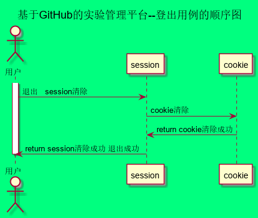

# “登出”用例 [返回](../README.md)

## 1. 用例规约

|用例名称|登出|
|-------|:-------------|
|功能|用户登出平台|
|参与者|学生/老师|
|前置条件| |
|后置条件|登出后，跳转到登录页面|
|主事件流| 1. 系统清除客户端登录信息（Cookie）|
|备选事件流|1a. 如果用户登录之后，长时间不超作界面，导致Cookie失效  &nbsp;&nbsp; 1.系统清除客户端登录信息（Cookie|

## 2. 业务流程（顺序图） [源码](../src/sequence登出.puml)
 

## 3. 界面设计
- 界面参照:[登出.html](https://201710414205.github.io/is_analysis_pages/test6/学生主页.html)
- API接口调用
    - 接口1：[logout](../接口/logout.md)

